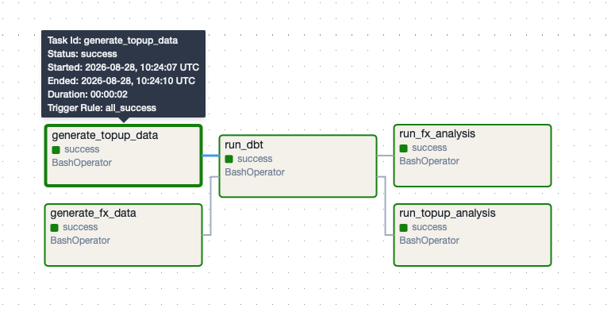
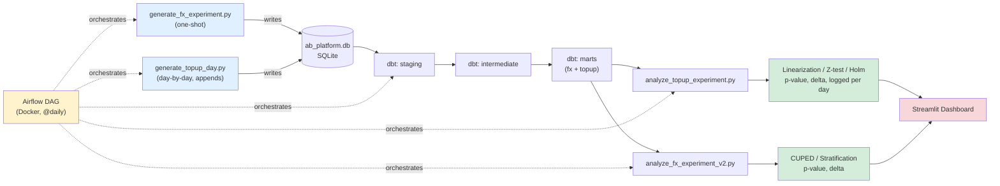

# A/B Testing Platform

A synthetic platform for designing, simulating, and statistically
evaluating A/B experiments on realistic fintech data, with a fully
automated pipeline from data generation to final result -- plus an
interactive dashboard and a sample-size calculator.

## Status: Complete

- [x] Data generator (FX fee reduction experiment)
- [x] Data generator (top-up limit experiment, day-by-day simulation)
- [x] Stats engine (t-test, linearization, CUPED, stratification,
      proportions z-test, Holm correction, sample size calculator)
- [x] pytest coverage (18 tests)
- [x] dbt models (staging -> intermediate -> marts, both experiments)
- [x] Airflow orchestration (Dockerized, @daily schedule, parallel branches)
- [x] Streamlit dashboard (4 pages, see below)

## Dashboard

Run `streamlit run dashboard.py` for an interactive view with 4 pages:

1. **Experiment Overview (FX)** -- headline result, method comparison
   (naive / CUPED / stratification / linearization)
2. **Peeking Problem Demo** -- simulated day-by-day p-values on an
   AA-test vs. a real effect, showing why early stopping inflates
   the false positive rate
3. **Top-up Experiment (Day-by-Day)** -- live p-value/delta evolution
   across accumulated experiment days, Holm-corrected significance,
   naive-vs-linearization comparison
4. **Sample Size Calculator** -- MDE / sample size calculator
   (relative or absolute effect, adjustable alpha/power), equivalent
   to evanmiller.org/ab-testing, implemented from scratch


*The Airflow DAG orchestrating both experiments: parallel data
generation, shared dbt transformation, parallel analysis.*

## Experiment 1: FX Fee Reduction

**Hypothesis:** Reducing the currency exchange fee from 0.5% to 0.2%
increases FX revenue per user through higher exchange frequency.

**Design:**
- 50/50 split via double hashing (separate salts for bucket assignment
  and group assignment)
- Stratified by country (UK, DE, PL, ES)
- CUPED covariate: historical FX revenue (4 weeks pre-experiment)

**Result:** The effect is statistically significant but negative
(delta ~= -1.02 EUR/user, p < 0.0001) -- the fee cut outweighs the
frequency lift, meaning the change would reduce total FX revenue.

**Note on linearization:** standard linearization assumes a stable
Y/X ratio across groups. Since the fee itself differs by group here
(it's the treatment), CUPED and stratification are more reliable than
raw linearization for this specific metric design.

## Experiment 2: Top-up Limit Increase (day-by-day)

**Hypothesis:** raising the instant top-up limit from EUR 500 to
EUR 1000 increases the average top-up amount per user, but may also
increase fraud and chargeback rates (guardrail metrics).

**Design:**
- 50/50 split via double hashing
- Primary metric (avg top-up amount) is a **ratio metric** -- evaluated
  via linearization, not a naive per-user mean, since transaction count
  varies across users
- Guardrail metrics (fraud rate, chargeback rate) are proportions --
  evaluated via a two-proportion z-test
- Multiple testing across the 3 metrics corrected with **Holm's method**
- Unlike Experiment 1, this experiment is simulated **incrementally**:
  each pipeline run adds one new day of transactions to a fixed user
  population, and re-evaluates all metrics on the data accumulated so
  far. This surfaces the peeking problem directly in the results --
  `fraud_rate`'s p-value dips toward 0.05 on some days from pure noise,
  then drifts back up as more data arrives.

**Result (after 10+ simulated days):** `avg_topup_amount` is
significant from day 1 onward (effect is large and immediate).
`fraud_rate` and `chargeback_rate` remain not significant under Holm
correction throughout, despite `fraud_rate` briefly approaching the
raw 0.05 threshold -- illustrating why a single metric's raw p-value
shouldn't be trusted when evaluating several metrics at once.

## Architecture



Both experiments share the same dbt transformation layer and Airflow
DAG. FX generates its full dataset in one shot each run; top-up
generates one incremental day per run, simulating an experiment that
grows over time.

## Stack

- Python (pandas, numpy, scipy)
- SQLite (data storage)
- dbt-core + dbt-sqlite (data transformation)
- Apache Airflow + Docker (orchestration)
- Streamlit + Plotly (dashboard)
- pytest (testing)
- Statistical methods: t-test, linearization, CUPED, stratification,
  proportions z-test, Holm correction, sample size / MDE calculation

## How to run

```bash
# 1. Setup
python3 -m venv .venv
source .venv/bin/activate
pip install pandas numpy scipy pytest dbt-core==1.4.9 dbt-sqlite==1.4.0 streamlit plotly

# 2a. Generate FX data (one-shot)
python3 data_generator/generate_fx_experiment.py

# 2b. Generate top-up data (one day per run -- run multiple times to
#     simulate multiple days of the experiment)
python3 data_generator/generate_topup_day.py

# 3. Transform with dbt
cd ab_platform_dbt && dbt run --profiles-dir ../.dbt_profiles

# 4. Analyze
cd .. && python3 analyze_fx_experiment_v2.py
python3 analyze_topup_experiment.py

# 5. Dashboard
streamlit run dashboard.py

# Or run everything via Airflow (each trigger = one more day for the
# top-up experiment)
cd airflow && docker compose up -d
# Open http://localhost:8080, trigger ab_platform_pipeline
```

## Why these design choices

Notes on methodology decisions made throughout this project, aimed at
demonstrating awareness of common pitfalls in experimentation:

- **Double hashing** ensures orthogonality between experiments sharing
  the same bucket pool -- a user's assignment in one experiment is
  independent of their assignment in another.
- **CUPED covariate is computed from a pre-experiment period only**,
  never from data overlapping the experiment window, to avoid leaking
  treatment effects into the correction.
- **Linearization coefficient (kappa) is computed from the control
  group only**, and applied identically to both groups -- computing it
  separately per group would mask the very effect being measured.
- **Ratio metrics use linearization, not naive per-user averaging** --
  averaging per-user means gives disproportionate weight to users with
  few observations, distorting the variance estimate.
- **Multiple metrics require multiple-testing correction** (Holm) --
  evaluating 3 metrics at alpha=0.05 each inflates the true false
  positive rate to ~14%; Holm keeps the family-wise error rate at 5%.
- **The top-up experiment's evaluation date is pre-registered
  (14 days)** and the dashboard displays progress against that plan,
  rather than treating each day's snapshot as a final result -- the
  day-by-day p-value chart exists specifically to show why "peeking"
  and stopping early is unreliable.

## Acknowledgements

The core statistical methods in this project (linearization, CUPED,
stratification, and the initial FX experiment design) were developed
as part of the A/B Testing course by **Karpov.Courses** (ООО "Карпов
Курсы") -- [karpov.courses](https://karpov.courses/). Everything
beyond that -- the second experiment (top-up limit increase), the
day-by-day simulation, the proportions z-test and Holm correction
integration, the dbt models, the Airflow orchestration, the Streamlit
dashboard, and the sample size calculator -- was built independently
as an extension of the course material.
