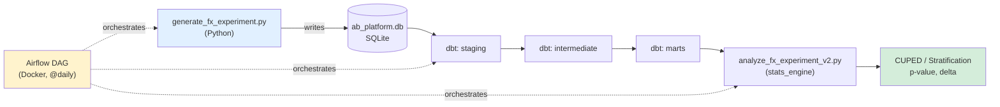

# A/B Testing Platform

A synthetic platform for designing, simulating, and statistically 
evaluating A/B experiments on realistic fintech data, with a fully 
automated pipeline from data generation to final result.

## Status: Core pipeline complete
- [x] Data generator (FX fee reduction experiment)
- [x] Stats engine (t-test, linearization, CUPED, stratification)
- [x] pytest coverage (9 tests)
- [x] dbt models (staging -> intermediate -> marts)
- [x] Airflow orchestration (Dockerized, @daily schedule)
- [ ] Dashboard (with peeking-problem visualization)
- [ ] Second experiment (top-up limit, multiple testing correction)

## Experiment 1: FX Fee Reduction

**Hypothesis:** Reducing the currency exchange fee from 0.5% to 0.2% 
increases FX revenue per user through higher exchange frequency.

**Design:**
- 50/50 split via double hashing (separate salts for bucket assignment 
  and group assignment)
- Stratified by country (UK, DE, PL, ES)
- CUPED covariate: historical FX revenue (4 weeks pre-experiment)

**Result:** The effect is statistically significant but negative 
(delta ~= -1.02 EUR/user, p < 0.0001) -- the fee cut outweighs the 
frequency lift, meaning the change would reduce total FX revenue.

**Note on linearization:** standard linearization assumes a stable 
Y/X ratio across groups. Since the fee itself differs by group here 
(it's the treatment), CUPED and stratification are more reliable than 
raw linearization for this specific metric design.

## Architecture \
## Architecture



All three steps are orchestrated by an Airflow DAG running in Docker, scheduled daily.\
## Stack
- Python (pandas, numpy, scipy)
- SQLite (data storage)
- dbt-core + dbt-sqlite (data transformation)
- Apache Airflow + Docker (orchestration)
- pytest (testing)
- Statistical methods: t-test, linearization, CUPED, stratification \

## How to run

```bash
# 1. Setup
python3 -m venv .venv
source .venv/bin/activate
pip install pandas numpy scipy pytest dbt-core==1.4.9 dbt-sqlite==1.4.0

# 2. Generate data
python3 data_generator/generate_fx_experiment.py

# 3. Transform with dbt
cd ab_platform_dbt && dbt run

# 4. Analyze
cd .. && python3 analyze_fx_experiment_v2.py

# Or run everything via Airflow
cd airflow && docker compose up -d
# Open http://localhost:8080, trigger ab_platform_pipeline
```

## Why these design choices

Notes on methodology decisions made throughout this project, aimed at 
demonstrating awareness of common pitfalls in experimentation:

- **Double hashing** ensures orthogonality between experiments sharing 
  the same bucket pool -- a user's assignment in one experiment is 
  independent of their assignment in another.
- **CUPED covariate is computed from a pre-experiment period only**, 
  never from data overlapping the experiment window, to avoid leaking 
  treatment effects into the correction.
- **Linearization coefficient (kappa) is computed from the control 
  group only**, and applied identically to both groups -- computing it 
  separately per group would mask the very effect being measured.
